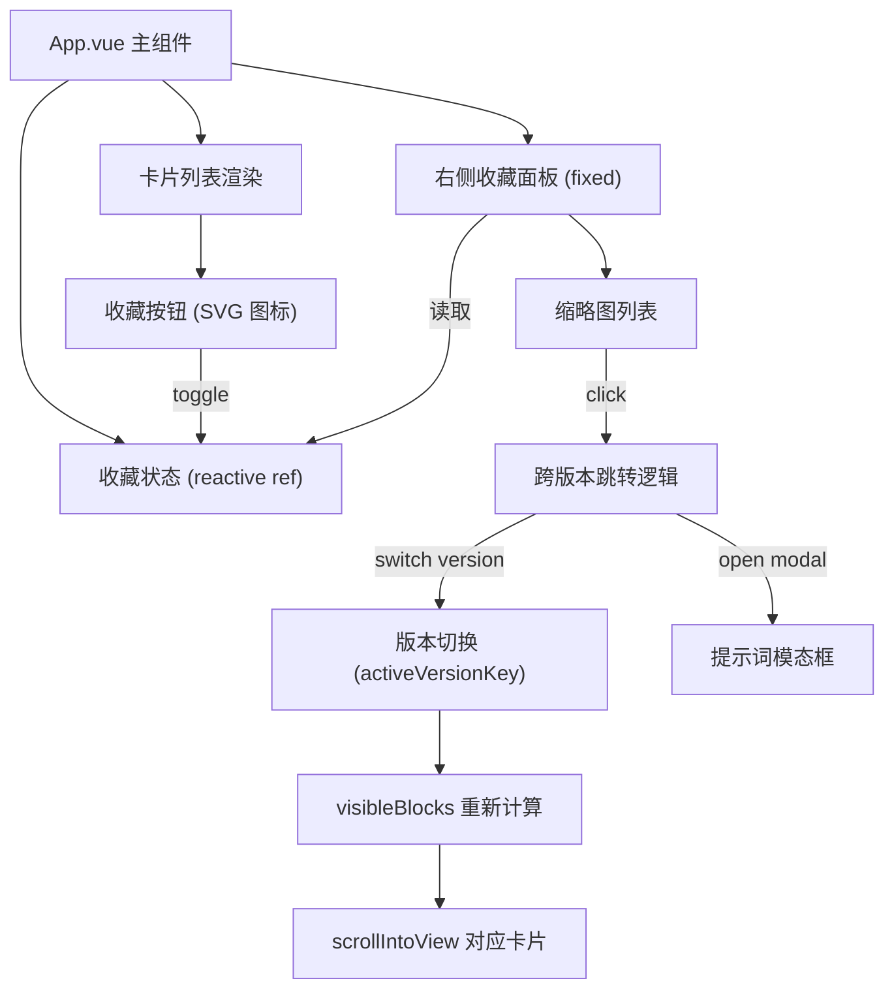

# 收藏功能技术设计

Feature Name: bookmark-favorites
Updated: 2026-06-23

## Description

在现有 Vue 3 单页应用中新增收藏功能。每张卡片增加收藏按钮，收藏的卡片缩略图以固定面板形式展示在页面右侧。点击缩略图可自动切换版本并打开对应提示词模态框。收藏数据存于内存，刷新重置。

## Architecture



所有新增功能均集成在 App.vue 中，不新增独立组件文件，避免过度拆分现有单文件架构。

## Components and Interfaces

### 1. 数据模型 - BookmarkItem

```typescript
interface BookmarkItem {
  image: string
  title: string
  prompt: string
  section: string
  blockIndex: number
  versionKey: string
}
```

| 字段 | 类型 | 说明 |
|------|------|------|
| `image` | `string` | 缩略图 URL，用于面板展示 |
| `title` | `string` | 卡片标题 |
| `prompt` | `string` | 完整提示词文本 |
| `section` | `string` | 所属章节名称 |
| `blockIndex` | `number` | 在原始 blocks 数组中的索引 |
| `versionKey` | `string` | 收藏时的版本标识 (`'latest'` 或 `sha`) |

### 2. 状态管理

在 `<script setup>` 中新增响应式状态：

```typescript
const bookmarks = ref<BookmarkItem[]>([])
```

无持久化存储，页面刷新后自动重置为空数组。

计算属性：

```typescript
// 判断某张卡片是否已被收藏
const isBookmarked = (index: number, versionKey: string): boolean => {
  return bookmarks.value.some(
    (b) => b.blockIndex === index && b.versionKey === versionKey
  )
}
```

### 3. 收藏按钮

**位置**: 每张卡片的 `.actions` 区域内（现有 "via X" 链接和 "复制" 按钮旁），新增一个 SVG 图标按钮。

**交互**:
- 未收藏: 显示空心书签图标，点击后 `bookmarks.value.push(item)`
- 已收藏: 显示实心书签图标（同色系高亮），点击后 `bookmarks.value = bookmarks.value.filter(...)`

**去重**: 同一卡片在同一版本下不可重复收藏。`(blockIndex, versionKey)` 为唯一键。

### 4. 右侧收藏面板

**位置**: `position: fixed; right: 0; top: 50%; transform: translateY(-50%)`，z-index 低于 lightbox(1200) 和 prompt-modal(1300)，设为 500。

**结构**:
```
.bookmark-panel
  .bookmark-panel-header  → "收藏" 标题 + 计数
  .bookmark-panel-list
    .bookmark-item (v-for)
      img.thumb              → 缩略图 (48x48, object-fit: cover)
      span.title             → 标题 (单行省略)
```

**样式**: 沿用现有暖色调风格：
- 背景: `#fffaf2` / `#fff7ec`
- 边框: `1px solid #f2d3b7`
- 圆角: `18px`
- 阴影: `0 12px 30px rgba(164, 95, 44, 0.11)`
- 字体: `'Trebuchet MS', 'Gill Sans', sans-serif` (标题), `Georgia, Cambria, serif` (正文)

**移动端** (视口 < 768px):
- 面板隐藏
- 页面底部固定一个收藏入口按钮（与 back-to-top 按钮并列）
- 点击入口展开底部抽屉面板

### 5. 缩略图点击处理 (跨版本跳转)

```typescript
const handleBookmarkClick = (item: BookmarkItem) => {
  // 1. 若当前版本与收藏版本不同，先切换版本
  if (activeVersionKey.value !== item.versionKey) {
    activeVersionKey.value = item.versionKey
  }
  // 2. 等待 DOM 更新后滚动到对应卡片
  nextTick(() => {
    const cards = document.querySelectorAll('.card')
    if (cards[item.blockIndex]) {
      cards[item.blockIndex].scrollIntoView({ behavior: 'smooth', block: 'center' })
    }
    // 3. 打开提示词模态框
    const block = visibleBlocks.value[item.blockIndex]
    if (block) {
      openPromptModal(block.prompt, item.blockIndex)
    }
  })
}
```

### 6. 版本切换时的行为

- 切换历史版本 (`selectVersion`) 时，`bookmarks` 列表保持不变
- 收藏面板始终展示所有收藏项，不因版本切换而筛选
- 点击非当前版本的收藏项时，执行上述跨版本跳转逻辑

## Data Models

### BookmarkItem (完整定义)

```typescript
interface BookmarkItem {
  image: string
  title: string
  prompt: string
  section: string
  blockIndex: number
  versionKey: string
}
```

- `blockIndex` 对应 `article.blocks` 或 `article.historyVersions[n].blocks` 中的索引
- `versionKey` 取值: `'latest'` (最新版本) 或 `sha` 字符串 (历史版本)

## Correctness Properties

1. **去重**: 同一 `(blockIndex, versionKey)` 组合不可重复收藏
2. **版本一致性**: 跨版本跳转时，先同步 `activeVersionKey` 再操作 DOM
3. **内存生命周期**: 刷新页面后 `bookmarks` 重置为 `[]`
4. **面板定位**: 固定定位面板不遮挡 lightbox(1200) 和 prompt-modal(1300)

## Error Handling

| 场景 | 处理策略 |
|------|----------|
| 点击缩略图时对应 block 在当前版本不存在 | 静默忽略，不打开模态框 |
| 版本切换后 blockIndex 越界 | 仅滚动到存在的最新卡片 |
| 收藏按钮快速连击 | 利用 `isBookmarked` 做幂等保护，toggle 语义保证状态正确 |

## Test Strategy

| 测试类型 | 内容 |
|----------|------|
| 单元测试 | `isBookmarked` 计算逻辑，`handleBookmarkClick` 跨版本跳转逻辑 |
| 集成测试 | 收藏/取消收藏完整流程，版本切换后收藏列表保持 |
| 视觉验证 | 手动验证桌面端和移动端面板展示效果 |
| 边界测试 | 空收藏列表面板隐藏，全量取消收藏后面板消失，快速连击收藏按钮 |

## References

[^1]: (App.vue#L140-L403) - 现有组件逻辑与数据流
[^2]: (App.vue#L406-L1058) - 现有 UI 样式系统
[^3]: (vite.config.ts) - Vite 配置
