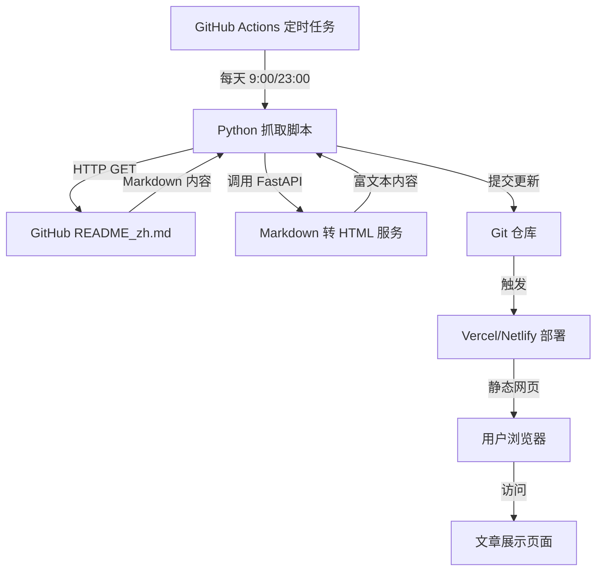

# GPT-Image2 文章发布系统设计

Feature Name: gpt-image2-article-publisher
Updated: 2026-05-26

## Description

本系统是一个定时抓取 GitHub 文档并转换为精美网页展示的文章发布平台。系统采用前后端分离架构，使用 GitHub Actions 执行定时抓取任务，Python FastAPI 提供数据处理服务，Vue 3 + Vite 构建现代化前端界面。

## Architecture



## Components and Interfaces

### 1. GitHub Actions Workflow
- **文件**: `.github/workflows/sync-document.yml`
- **职责**: 定时执行抓取任务
- **触发条件**: Cron 表达式 `0 1,23 * * *` (UTC 时间 1:00 和 23:00，对应北京时间 9:00 和 23:00)

### 2. Python 抓取服务
- **文件**: `backend/main.py`
- **职责**: 
  - 获取 GitHub 文档内容
  - 调用 FastAPI 转换 Markdown
  - 保存处理后的数据
- **技术栈**: Python 3.11, FastAPI, httpx

### 3. 前端应用
- **文件**: `frontend/`
- **职责**: 
  - 展示文章内容
  - 提供目录导航
  - 支持主题切换
- **技术栈**: Vue 3, Vite, TypeScript, Tailwind CSS

### 4. 数据文件
- **文件**: `public/data/article.json`
- **职责**: 存储抓取后的文章内容（标题、内容、更新时间）

## Data Models

### Article 数据结构
```typescript
interface Article {
  title: string;           // 文章标题
  content: string;         // HTML 富文本内容
  updateAt: string;        // ISO 8601 格式更新时间
  source: string;          // 源 GitHub 文档地址
}
```

## Correctness Properties

1. **定时一致性**: 每天必须执行两次抓取任务（北京时间 9:00 和 23:00）
2. **内容完整性**: 抓取的 Markdown 必须完整转换为 HTML，不丢失任何内容
3. **故障恢复**: 单次任务失败不影响已发布内容
4. **响应式适配**: 页面必须在 375px~1920px 宽度范围内正常显示

## Error Handling

1. **GitHub 文档无法访问**: 记录错误日志，保留上一次成功内容
2. **Markdown 转换失败**: 抛出异常并在 GitHub Actions 中标记失败
3. **前端加载失败**: 显示友好的错误提示页面

## Test Strategy

1. **单元测试**: Python 抓取脚本的函数测试
2. **集成测试**: GitHub Actions workflow 端到端测试
3. **视觉回归测试**: 前端页面在不同设备尺寸下的显示效果
4. **性能测试**: 页面加载时间和首屏渲染时间

## References

[^1]: (GitHub Actions Cron) - [定时任务语法](https://docs.github.com/en/actions/writing-workflows/choosing-when-your-workflow-runs/events-that-trigger-workflows#schedule)
[^2]: (Vue 3 + Vite) - [Vite 官方文档](https://vitejs.dev/)
[^3]: (FastAPI) - [FastAPI 官方文档](https://fastapi.tiangolo.com/)
[^4]: (Tailwind CSS) - [Tailwind CSS 官方文档](https://tailwindcss.com/)
