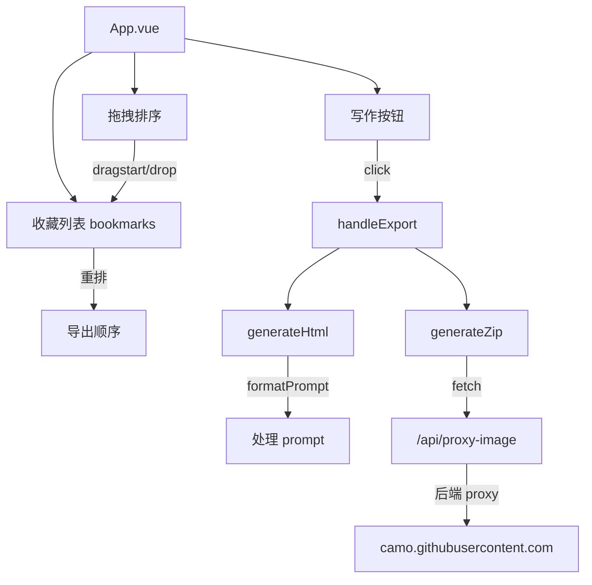

# 写作导出功能技术设计

Feature Name: writing-export
Updated: 2026-07-18

## Description

在现有收藏功能基础上新增"写作"导出功能和拖拽排序。点击"写作"后显示进度条，处理完成后提供"文本"和"图片"两个独立下载按钮。文本输出为 HTML 格式排版文件，prompt 内容经过格式化处理。收藏列表支持拖拽重排。所有功能集成在 App.vue 中，不新增独立组件文件。

## Architecture



## Components and Interfaces

### 1. 依赖

`frontend/package.json` 新增：

```json
"jszip": "^3.10.1"
```

JSZip 自带 TypeScript 类型声明，无需额外安装 `@types/jszip`。

### 2. 数据模型

```typescript
interface BookmarkItem {
  image: string
  title: string
  prompt: string
  section: string
  blockIndex: number
  versionKey: string
  description: string
  xUrl?: string
  publishedAt?: string
  author?: string
  language?: string
}
```

相比收藏功能 v1，新增了 `description`、`xUrl`、`publishedAt`、`author`、`language` 字段以满足导出内容完整性需求。

### 3. 写作按钮与交互流程

**位置**: 仅在右侧桌面端收藏面板底部（`.bookmark-panel` 内），移动端抽屉不显示。

**交互流程**:

1. 点击"写作"按钮 → 按钮消失，显示进度条 + "正在写作处理中..."
2. 后台并行生成长文本（同步）和压缩包（异步 fetch 图片）
3. 完成后进度条消失，显示"文本"和"图片"两个下载按钮
4. 点击"文本" → 下载 `.html` 文件
5. 点击"图片" → 下载 `.zip` 文件

**状态变量**:

```typescript
const isExporting = ref(false)         // 是否正在生成
const exportReady = ref(false)         // 是否生成完成
const exportError = ref('')            // 错误信息
const cachedTextBlob = ref<Blob | null>(null)  // 缓存的文本 Blob
const cachedZipBlob = ref<Blob | null>(null)   // 缓存的 ZIP Blob
const cachedTimestamp = ref('')        // 时间戳（保证文件名一致）
```

### 4. HTML 文本生成 (`generateHtml`)

参照预设模板生成完整 HTML 文档，内嵌 CSS 样式。

**模板结构**:

```html
<!doctype html>
<html lang="zh-CN">
<head>
  <meta charset="utf-8">
  <title>...</title>
  <style>/* 内嵌完整 CSS */</style>
</head>
<body>
<h1>页面标题</h1>

<h2>No. 1: 章节 - 标题</h2>
<h3>描述</h3>
<p>...</p>
<h3>提示词</h3>
<pre>...</pre>
<h3>生成图片</h3>
<p></p>
<h3>详情</h3>
<p><strong>作者:</strong> ...</p>
<p><strong>来源:</strong> <a>Twitter Post</a></p>
<p><strong>发布时间:</strong> ...</p>
<p><strong>多语言:</strong> ...</p>
<hr>
<!-- 重复 -->
</body>
</html>
```

**标题处理**: 从 `b.title` 中移除原始 "No. X: " 前缀，重新按收藏序号编号：`No. {i+1}: {cleanTitle}`。

**HTML 转义**: 所有用户内容（标题、描述、提示词、作者等）通过 `escapeHtml` 函数转义 `&` `<` `>` `"`，防止注入。

### 5. Prompt 格式化 (`formatPrompt`)

在写入 HTML 前对 prompt 内容进行处理：

```typescript
const formatPrompt = (text: string): string => {
  return text.replace(/\{argument\s+name="[^"]+"\s+default="([^"]*)"\}/g, '$1')
}
```

将 `{argument name="xxx" default="yyy"}` 替换为 `yyy`。

### 6. 压缩包生成 (`generateZip`)

图片下载采用四级降级策略：

1. **直接 fetch** — 优先尝试目标 URL（同一域名或允许 CORS 的源）
2. **Camo URL 解码 fetch** — `decodeCamoUrl` 从 Camo URL hex 部分解码出原始 CDN 地址并直接获取
3. **代理** — `/api/proxy-image`（本地开发环境）
4. **缓存预热 fetch** — `cacheImageThenFetch`：用 `` 标签加载到浏览器缓存，再通过 `fetch(url, { cache: 'force-cache' })` 从缓存读取（绕过 `Sec-Fetch-Dest` 检查）

```typescript
const decodeCamoUrl = (url: string): string | null => {
  // 从 camo.githubusercontent.com/HASH/HEX_DATA 路径中解码原始 URL
  const hexData = url.split('/').filter(Boolean).at(-1)
  // hex → bytes → UTF-8 string
}

const cacheImageThenFetch = async (url: string): Promise<Blob | null> => {
  // 1. 创建  标签加载图片（发送 Sec-Fetch-Dest: image，Camo 允许）
  // 2. onload 后用 fetch(url, { cache: 'force-cache' }) 从缓存读取
  //    （缓存响应可能跳过 CORS 检查）
}
```

压缩包文件命名规则：
- 单图收藏项：`1.png`、`2.jpg`
- 多图收藏项（同标题多张变体）：`1(1).png`、`1(2).png`、`1(3).png`、`1(4).png`

```typescript
const fetchImage = async (url: string): Promise<Blob | null> => {
  // 先尝试直接 fetch（生产环境 Camo URL 可直连）
  const resp = await fetch(url)
  if (resp.ok) return await resp.blob()
  // fallback 到代理
  const proxyUrl = `/api/proxy-image?url=${encodeURIComponent(url)}`
  const resp2 = await fetch(proxyUrl)
  if (resp2.ok) return await resp2.blob()
  return null
}

const getSiblingImages = (bookmark: BookmarkItem): string[] => {
  // 在同版本 visibleBlocks 中查找所有同标题的 block，收集全部图片 URL
  return visibleBlocks.value
    .filter(b => b.title === bookmark.title && b.image)
    .map(b => b.image)
}

const generateZip = async (groups: string[][]): Promise<Blob> => {
  const zip = new JSZip()
  for (let gi = 0; gi < groups.length; gi++) {
    for (let ii = 0; ii < groups[gi].length; ii++) {
      const blob = await fetchImage(groups[gi][ii])
      if (blob) {
        const ext = getImageExtension(blob.type, groups[gi][ii])
        const name = groups[gi].length > 1
          ? `${gi + 1}(${ii + 1}).${ext}`
          : `${gi + 1}.${ext}`
        zip.file(name, blob)
      }
    }
  }
  return zip.generateAsync({ type: 'blob' })
}
```

### 7. 后端代理修改

`backend/main.py:510` — 代理域名白名单扩展：

```python
allowed_hosts = ("cms-assets.youmind.com", "marketing-assets.youmind.com", "camo.githubusercontent.com")
```

对已是 Camo 格式的 URL 跳过 `resolve_camo_url` 调用，直接 fetch。

### 8. 拖拽排序

使用 HTML5 Drag & Drop API 实现，桌面端和移动端一致。

**状态**:

```typescript
const dragBookmarkIndex = ref<number | null>(null)     // 被拖拽项索引
const dragOverBookmarkIndex = ref<number | null>(null) // 悬停目标索引
```

**处理函数**:

| 函数 | 事件 | 行为 |
|------|------|------|
| `onBookmarkDragStart` | dragstart | 记录拖拽源索引，设置 `effectAllowed = 'move'` |
| `onBookmarkDragOver` | dragover | 阻止默认行为，记录悬停目标索引 |
| `onBookmarkDrop` | drop | 从原位置移除，插入新位置，更新 bookmarks 数组 |
| `onBookmarkDragEnd` | dragend | 清除所有拖拽状态 |
| `@dragleave` | dragleave | 清除悬停目标索引 |

**视觉反馈**: 被拖拽项 `opacity: 0.4`，悬停目标顶部显示 `2px solid #d89c5c` 引导线。

## Data Models

### ExportBookmarkItem (隐式)

`generateHtml` 和 `generateZip` 接收 `BookmarkItem[]`，内部通过展开运算符深拷贝操作，不修改原始数据。

## Correctness Properties

1. **幂等性**: `handleExport` 在 `isExporting` 为 true 时直接返回
2. **按钮可见性**: 写作按钮绑定 `bookmarks.length > 0`
3. **图片容错**: 单张图片 fetch 失败不影响其他图片
4. **HTML 安全**: 所有用户内容经 `escapeHtml` 转义
5. **拖拽去重**: `dragIndex === dropIndex` 时跳过操作
6. **多图完整性**: 同一标题下所有变体图片自动聚合，确保收藏一项即获得全部关联图片
7. **纯前端实现**: 不涉及后端新增接口，仅扩展现有代理白名单

## Error Handling

| 场景 | 处理策略 |
|------|----------|
| 某张图片 fetch 失败 | 静默跳过，该图片不加入 ZIP |
| 所有图片均失败 | ZIP 为空，仍可正常下载 |
| 导出过程异常 | 显示"生成失败，请稍后重试" |
| 快速连击按钮 | `isExporting` 互斥锁阻止 |
| 拖拽放置到自身 | 无操作 |

## References

- `frontend/src/App.vue` — 全部组件逻辑
- `frontend/src/App.vue#L592-646` — `generateHtml` 和 `formatPrompt`
- `frontend/src/App.vue#L700-710` — `fetchImage` 和 `getSiblingImages`
- `frontend/src/App.vue#L712-733` — `generateZip`
- `frontend/src/App.vue#L735-756` — `handleExport` 和下载函数
- `frontend/src/App.vue#L558-596` — 拖拽排序处理函数
- `backend/main.py#L507-535` — 图片代理端点
- `frontend/vite.config.ts` — API 反向代理配置

## Changelog

| 日期 | 变更 |
|------|------|
| 2026-07-18 | 初始设计完成 |
| 2026-07-18 | 文本格式改为 HTML 排版，新增 `generateHtml`、`escapeHtml`、`formatPrompt` |
| 2026-07-18 | 交互改为进度条 + 分步下载按钮 |
| 2026-07-18 | 后端代理白名单扩展 `camo.githubusercontent.com` |
| 2026-07-18 | 新增拖拽排序功能（HTML5 Drag & Drop） |
| 2026-07-18 | BookmarkItem 扩展 description/xUrl/publishedAt/author/language 字段 |
| 2026-07-18 | `fetchImage` 改为优先直连 Camo URL（适配 GitHub Pages 生产环境），失败 fallback 代理 |
| 2026-07-18 | 新增 `getSiblingImages`：收藏一项自动包含同标题所有变体图片，命名 `1(1)`, `1(2)` 格式 |
| 2026-07-18 | `generateZip` 签名改为 `(groups: string[][])` 支持多图分组 |
| 2026-07-18 | 新增 `decodeCamoUrl`：Camo URL hex 解码提取原始 CDN 地址 |
| 2026-07-18 | 新增 `cacheImageThenFetch`：img 预热缓存 + fetch 从缓存读取，绕过 Sec-Fetch-Dest 限制 |
